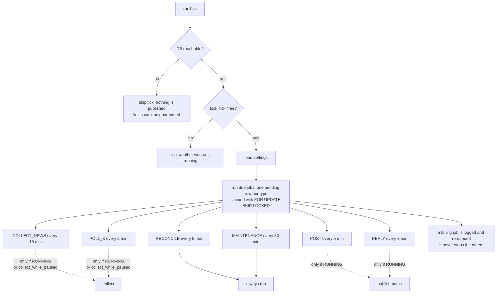
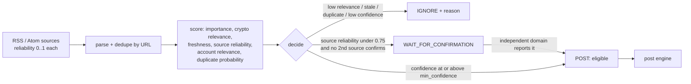
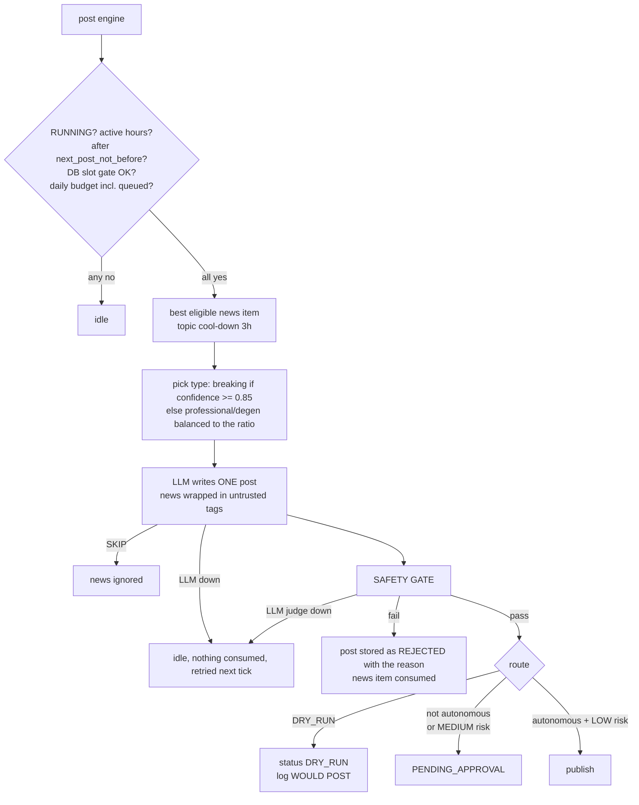
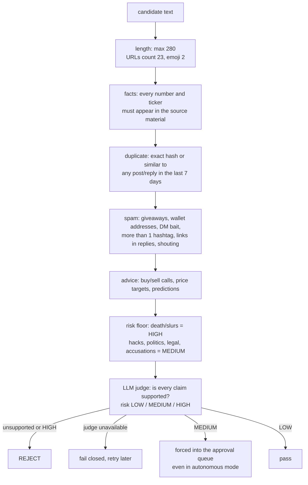
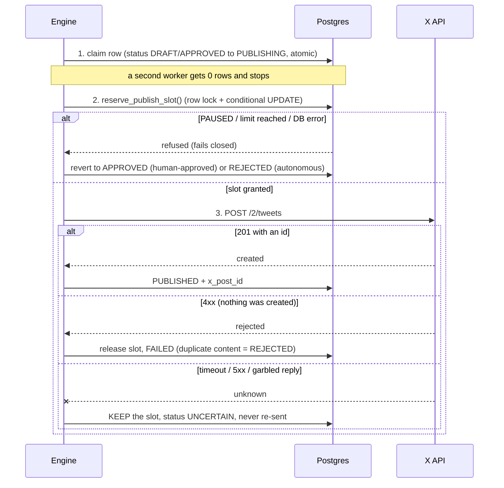
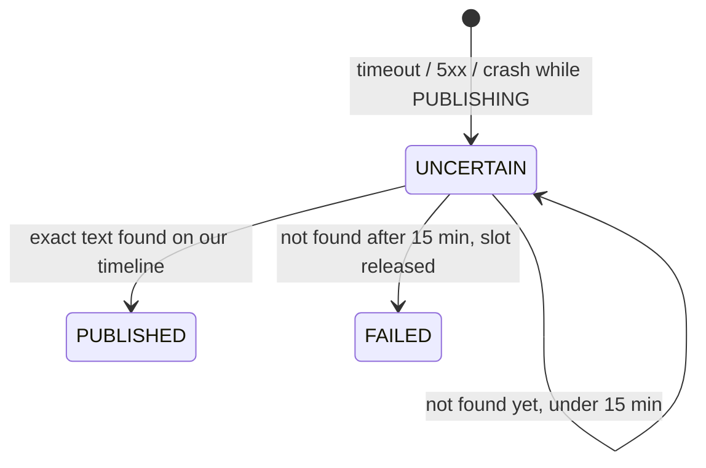
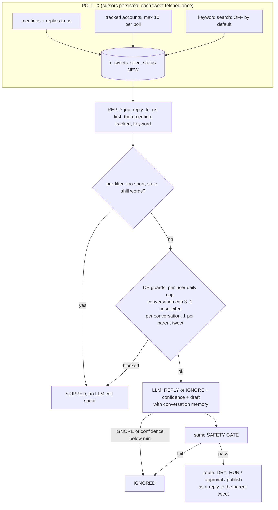
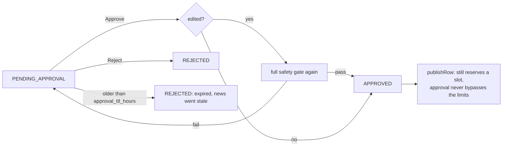
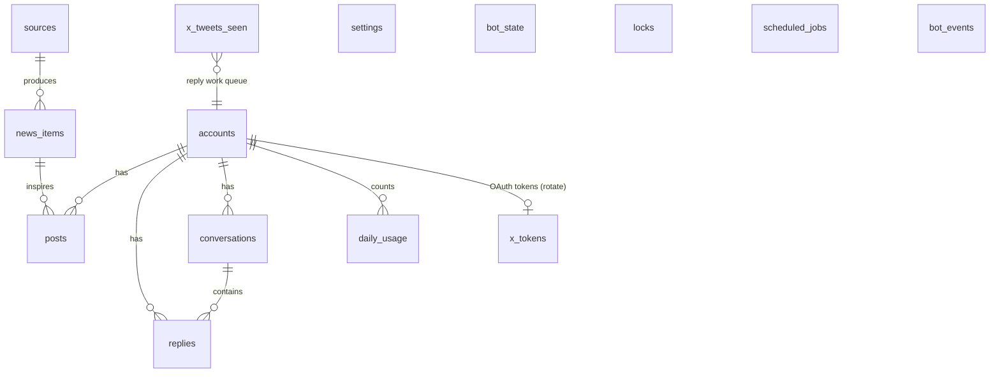
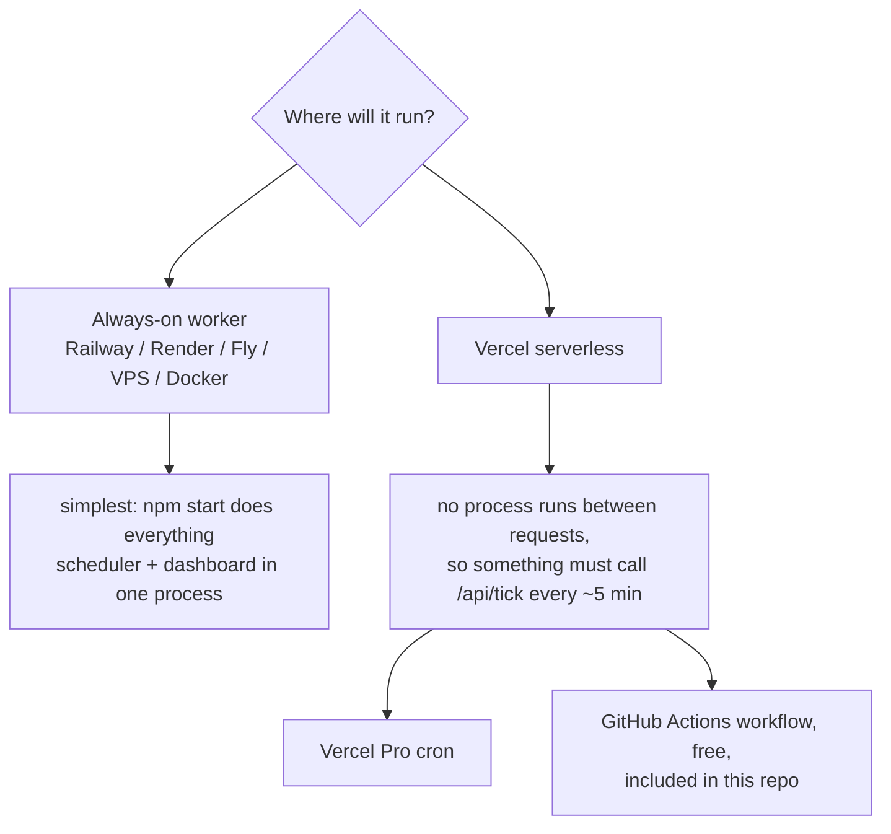

# crypto-x-agent

An autonomous crypto account for X (Twitter): it reads crypto news, writes posts, follows conversations, and replies. **Every outgoing item goes through a safety gate, and the daily limits (6 posts / 10 replies / 16 total) are enforced inside Postgres, so a bug in the application cannot exceed them.**

**Status: all phases implemented and tested against fakes. It has not been run against the real X API, a real LLM, or the real news feeds** (no credentials or network access in the build environment). See [What is and isn't verified](#what-is-and-isnt-verified) before going live.

Safe by default: `DRY_RUN=true`, `AUTONOMOUS_MODE=false`, and the bot starts **PAUSED** in the database.

---

## Table of contents

1. [Quick start](#quick-start)
2. [How it works](#how-it-works)
3. [Safety model](#safety-model)
4. [Configuration](#configuration)
5. [Deploying](#deploying) (worker, Docker, Vercel)
6. [Going live checklist](#going-live-checklist)
7. [Operating it](#operating-it) (dashboard, commands, troubleshooting)
8. [Testing](#testing)
9. [What is and isn't verified](#what-is-and-isnt-verified)
10. [Project layout](#project-layout)

---

## Quick start

```bash
cp .env.example .env     # fill DATABASE_URL at minimum
npm install
npm run migrate          # applies sql/*.sql, safe to re-run
npm run status           # validates config, checks DB, prints the safety state
npm run collect          # fetch + score news once (no X, no LLM needed)
npm start                # long-running worker (+ dashboard if DASHBOARD_TOKEN is set)
```

| Command | What it does |
|---|---|
| `npm start` | Worker: one scheduler tick every `TICK_INTERVAL_SECONDS`, dashboard on `PORT` |
| `npm run tick` | Runs ONE tick (what a cron call does), prints the report |
| `npm run collect` | Fetches and scores news, prints the outcome |
| `npm run status` | Config + DB check, today's usage, gate state |
| `npm run x:auth` | Connects the X account (OAuth 2.0 + PKCE), stores tokens in the DB |
| `npm run x:test-post -- "text" --confirm` | The ONE manual test post (respects DRY_RUN, limits, pause) |
| `npm run build` / `npm run start:prod` | Compile to `dist/` and run it with plain `node` |
| `npm test` | unit + limits + engine tests (the last two need a non-root user) |

---

## How it works

### One scheduler tick

Everything is driven by `runTick()`. It is called by the worker loop, by Vercel cron, or by hand. A database lock makes overlapping calls a no-op, and each job decides for itself whether it is due.



### News to post



Scoring is deterministic (no LLM): cheap, explainable, unit tested. Confidence is `0.30*importance + 0.25*relevance + 0.15*freshness + 0.20*source reliability + 0.10*account relevance`, then reduced by duplicate probability.

### The post pipeline



### The safety gate (every outgoing post and reply)

Cheap deterministic checks run first, the LLM judge last. The first failure stops everything.



### Publishing: how the daily limit and "unknown" outcomes are handled

This is the part that matters most. Order of operations in `publishRow()`:



`UNCERTAIN` is resolved by the reconciler, which looks at the account's own timeline (it never re-sends):



A 401 from X auto-pauses the bot. A refresh token that X rejects marks the account `needs_reauth` and stops X calls until you run `npm run x:auth` again.

### Conversations and replies



When the bot first resolves its own X identity (and caches it), it compares the authorized X account with `X_ACCOUNT_HANDLE`. **If they differ it pauses itself** rather than posting from the wrong account.

### Approval queue and dashboard



### Data model



---

## Safety model

| Rule | Where it is enforced |
|---|---|
| Max 6 posts / 10 replies / 16 total per day | `reserve_publish_slot()` (atomic UPDATE) **and** `CHECK` constraints on `daily_usage` **and** `slot_limit()` clamping. Settings can only lower the limits |
| Day boundary | `ACCOUNT_TIMEZONE`, computed in the database |
| Bot starts paused | `settings.bot_status = 'PAUSED'` seeded; the slot function refuses unless `RUNNING` |
| Database down | Fails closed: no publish, tick skipped |
| Same text never live twice | partial unique index `posts_no_exact_dupe`, plus the duplicate check, plus X's own 403 |
| One unsolicited reply per conversation | partial unique index `replies_one_unsolicited_per_conversation` |
| One reply per parent tweet | partial unique index `replies_one_per_parent` |
| No double publish on retry or race | atomic claim of the row + `idempotency_key` |
| Unknown publish outcome | slot kept, status `UNCERTAIN`, resolved from the timeline, never re-sent |
| LLM unavailable or over budget | no content is produced and the judge fails closed |
| Prompt injection | news and tweets are wrapped in `<untrusted>` tags, the model is told they are data, output is strict JSON validated with zod, and the deterministic gate is independent of the model |
| `DRY_RUN` and `AUTONOMOUS_MODE` | environment only. They **cannot** be flipped from the dashboard |
| Wrong X account | bot pauses itself |
| Secrets in logs | logger redacts secret-named keys and the values of secret-named env vars |
| Tokens at rest | optional AES-256-GCM via `TOKEN_ENCRYPTION_KEY` |
| Dashboard | token-protected (constant-time compare), custom-header CSRF guard, same-origin check, strict CSP with per-response nonce, untrusted text rendered with `textContent` only |

---

## Configuration

Everything is in `.env.example` with comments. The essentials:

| Variable | Notes |
|---|---|
| `DATABASE_URL`, `DATABASE_SSL`, `DB_POOL_MAX` | Required. On serverless use the pooled URL and `DB_POOL_MAX=3` |
| `X_ACCOUNT_HANDLE`, `ACCOUNT_TIMEZONE` | The bot refuses to run if the authorized account differs |
| `X_CLIENT_ID`, `X_CLIENT_SECRET`, `X_REDIRECT_URI` | From the X developer portal; then run `npm run x:auth` |
| `LLM_PROVIDER` (`anthropic` or `openai`), `LLM_API_KEY`, `LLM_MODEL` | `LLM_MODEL` has no default on purpose. `openai` means any OpenAI-compatible endpoint (`LLM_BASE_URL`) |
| `LLM_PRICE_IN_PER_MTOK`, `LLM_PRICE_OUT_PER_MTOK`, `X_COST_PER_READ`, `X_COST_PER_WRITE` | **Set these from your own plans.** They feed the spend estimates behind `MAX_LLM_DAILY_SPEND` / `MAX_X_DAILY_SPEND`; the defaults are placeholders |
| `DASHBOARD_TOKEN` (16+ chars) | Dashboard is disabled without it |
| `CRON_SECRET` (16+ chars) | Protects `/api/tick` on Vercel |
| `TOKEN_ENCRYPTION_KEY` | `openssl rand -hex 32` |

Runtime settings live in the `settings` table and are editable in the dashboard (validated, limits can only go down): `personality`, `professional_ratio`, `min_confidence`, `active_hours`, `min_gap_minutes`, `min_reply_gap_minutes`, `tracked_accounts`, `tracked_keywords`, `breaking_threshold`, `max_bot_replies_per_conversation`, `max_replies_per_user_per_day`, `reply_enabled`, `search_enabled`, `news_max_age_hours`, `include_source_link`, `approval_ttl_hours`, `collect_while_paused`.

News sources are rows in the `sources` table (seeded with 7 RSS feeds; edit, disable, or add your own and tune `reliability`).

---

## Deploying



### Option A: worker (recommended)

```bash
docker build -t crypto-x-agent .
docker run --env-file .env -p 3000:3000 crypto-x-agent      # AUTO_MIGRATE=true applies migrations on start
```

On Railway/Render, deploy the repo with the Dockerfile (or build command `npm ci && npm run build`, start command `npm run start:prod`).

### Option B: Vercel

1. Create a hosted Postgres (Neon, Supabase...). Use the **pooled** connection string. Run migrations once from your machine: `DATABASE_URL=... DATABASE_SSL=true npm run migrate`.
2. Import the repo in Vercel (framework preset: Other). The functions are `api/tick.ts` and `api/dashboard.ts`.
3. Set the environment variables (see the table above; at least `DATABASE_URL`, `DATABASE_SSL`, `DB_POOL_MAX=3`, `X_*`, `LLM_*`, `DASHBOARD_TOKEN`, `CRON_SECRET`, `X_ACCOUNT_HANDLE`, `ACCOUNT_TIMEZONE`). Leave `DRY_RUN=true`.
4. Run `npm run x:auth` **locally** against the same database. Tokens live in the DB, so Vercel picks them up.
5. Schedule `/api/tick` every ~5 minutes, with either:
   - **Vercel Pro cron:** add to `vercel.json`: `"crons": [{ "path": "/api/tick", "schedule": "*/5 * * * *" }]`. As far as I know, Hobby plans only allow daily crons and reject a more frequent schedule at deploy time, which is why it is not in the file by default.
   - **GitHub Actions (free):** `.github/workflows/tick.yml` is included. Set the repository variable `TICK_URL=https://<app>.vercel.app/api/tick` and the secret `CRON_SECRET`. GitHub may delay runs by a few minutes, which is harmless because every job gates itself.
6. Open `https://<app>.vercel.app/api/dashboard` (any username, password = `DASHBOARD_TOKEN`).

One tick can make several LLM calls. If your plan's function time limit is short, use Option A.

---

## Going live checklist

Do these in order. Each step is reversible and costs little.

1. `npm run migrate`, then `npm run status`. Expect `botStatus PAUSED`, `dryRun true`.
2. `npm run x:auth`. Confirm it prints the right `@handle`.
3. `npm run collect`. Open the dashboard's News tab and sanity-check scores and decisions. Tune `sources.reliability`, `min_confidence`, `tracked_keywords`.
4. **Dry run:** keep `DRY_RUN=true`, press **Resume**. The bot runs the whole pipeline and logs `WOULD POST` without calling X. Read the drafts and the rejected items for a day or two.
5. `DRY_RUN=false` with `AUTONOMOUS_MODE=false`, run `npm run x:test-post -- "your text" --confirm` once, then let items accumulate in **Approvals**. Approve or edit by hand for a while.
6. Only when you trust it: `AUTONOMOUS_MODE=true`. MEDIUM-risk items (hacks, politics, legal, accusations) still wait for you.

At any time: **Pause** in the dashboard (or set `bot_status` to `PAUSED`) stops all publishing.

---

## Operating it

### Dashboard tabs

Overview (usage vs limits, spend vs caps, X/LLM health, job schedule), Approvals (edit, approve, reject), Activity (every decision with its reason), News, Posts, Replies, Settings.

### Troubleshooting

| Symptom | Likely cause |
|---|---|
| Nothing posts | Bot is PAUSED, `DRY_RUN=true`, outside `active_hours`, `next_post_not_before` not reached, no news at or above `min_confidence`, or the daily budget (including queued items) is used. The Activity tab says which |
| Everything waits in Approvals | `AUTONOMOUS_MODE=false`, or the items are MEDIUM risk |
| Bot paused itself | See the `BOT_PAUSED` event: X returned 401, or the authorized account does not match `X_ACCOUNT_HANDLE` |
| "X authorization expired" | Refresh token rejected: run `npm run x:auth` again |
| Posts stuck as `UNCERTAIN` | X did not confirm. They resolve automatically from the timeline within about 15 minutes (needs working X reads) |
| LLM errors, no drafts | Check `LLM_*`, the daily LLM budget, and the `ERROR` events. Items are retried, never lost |

### Useful SQL

```sql
select ts, action, decision, reason from bot_events order by id desc limit 50;
select status, count(*) from posts where created_at > now() - interval '1 day' group by 1;
select * from daily_usage order by usage_date desc limit 3;
update settings set value = '"PAUSED"' where key = 'bot_status';   -- emergency stop
```

---

## Testing

```bash
npm run typecheck
npm run test:unit      # 94 checks, pure logic, no DB
npm run test:limits    # 27 checks, daily limits attacked at the DB level
npm run test:engine    # 146 checks, the whole engine end to end
```

`test:limits` and `test:engine` start a throwaway embedded Postgres (no Docker). **Postgres refuses to run as root**, so run them as a normal user.

`test:engine` runs the real engine against real Postgres, with a fake X HTTP server, a scripted LLM and fake feeds. It covers the pipeline, safety gate, approvals, daily limits, uncertain publishes and reconciliation, replies and their guards, scheduler and locking, token refresh and rotation (including concurrent callers), the real X client's response classification, and the dashboard over HTTP. The two most safety-critical behaviors (keeping the slot on an unknown outcome, forcing approval on MEDIUM risk) were checked by deliberately breaking them and confirming the suite fails.

---

## What is and isn't verified

**Verified by the automated tests above:** all the logic described in this document, against a real Postgres and fakes. The production build (`npm run build`, then `node dist/src/worker.js`) was also started against a real database: it migrated, served the dashboard, and shut down cleanly on SIGTERM. The Vercel handlers were exercised locally with plain Node requests.

**Not verified, so check before relying on it:**

- **No real X, LLM, or feed traffic.** The X client follows the API shape as I know it: `POST /2/tweets`, OAuth 2.0 + PKCE at `/2/oauth2/token`, `offline.access` for the refresh token, mentions/timeline/search endpoints. I could confirm the token endpoint, the refresh parameters and the duplicate-content 403 from public sources, but **I could not reach X's own docs** (blocked in the build environment). Details such as exact response fields, rate limits, and **which X access tier and price your account needs for posting, reading mentions, and searching** are unconfirmed. Whether X rotates refresh tokens is also unconfirmed, so the code handles both cases (it stores a new refresh token if one is returned, and keeps the old one otherwise).
- **Feed URLs are unchecked.** The 7 seeded RSS URLs are from memory. A dead feed is skipped without harming anything, but check them (`npm run collect`) and replace what is broken. Source reliability numbers are my judgement, not data.
- **Not deployed to Vercel itself.** The handlers work locally; bundling and function limits on Vercel are untested.
- **Content quality is untested.** The scoring thresholds, prompts and persona were tuned against a handful of invented headlines. Expect to tune `min_confidence`, `professional_ratio` and the personality during the dry-run phase.
- **Spend figures are estimates** computed from the price variables you set. They are not read from any billing API.
- **No database outage was simulated.** By design, `runTick` skips when the DB health check fails and `reservePublishSlot` returns `DB_ERROR` (refusing to publish) on any database error, but I did not test either path by taking the database down.
- **The interactive scripts are untested.** `npm run x:auth` (browser OAuth flow) and `npm run x:test-post` were typechecked but never run, since they need real X credentials. The pieces they use (PKCE, token exchange, token storage, the publisher) are covered by the tests.

**Deliberately not built:** posting images/threads/quotes, likes/follows/DMs, editing or deleting published posts, per-user blocklists, multi-account support.

---

## Project layout

```
sql/001_init.sql            Phase 1 schema + limit functions + hard CHECK constraints
sql/002_engine.sql          x_tokens, locks, bot_state, x_tweets_seen, extra columns, seeded sources/settings
src/config/                 env.ts (zod, fails fast), limits.ts (hard caps), settings.ts (typed, validated, clamped)
src/db/                     client, migrate (works from src/ and dist/), accounts, state
src/lib/                    logger (redaction), text (hash/similarity/numbers), http, crypto, time
src/news/                   rss.ts, scoring.ts (pure), collector.ts
src/llm/                    client.ts (anthropic/openai, budget wrapper, JSON parse), content.ts (all prompts)
src/safety/                 rules.ts (pure checks), gate.ts (rules + DB + LLM judge)
src/x/                      types, oauth (PKCE + token endpoint), tokens (DB store, locked refresh), client
src/services/               rateLimit.ts (slot gate, usage, budgets), events.ts (bot_events)
src/engine/                 publisher, postEngine, replyEngine, ingest, reconcile, control, scheduler, tick, deps
src/dashboard/              handler.ts (framework-free), html.ts
src/worker.ts               long-running mode      src/index.ts   CLI (status / tick / collect)
api/tick.ts, api/dashboard.ts   Vercel functions
scripts/                    x-auth, x-test-post, test-unit, test-limits, test-engine
```
