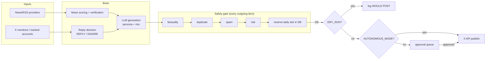
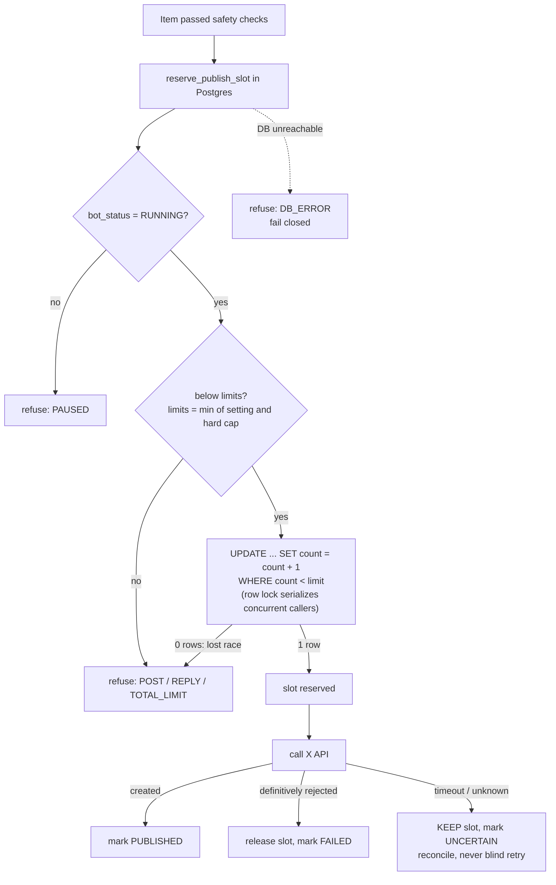
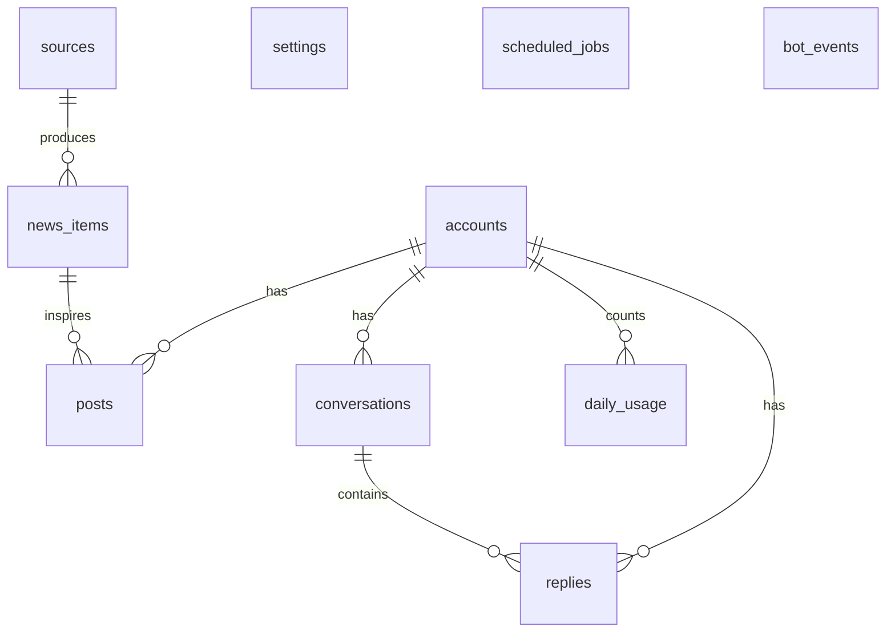
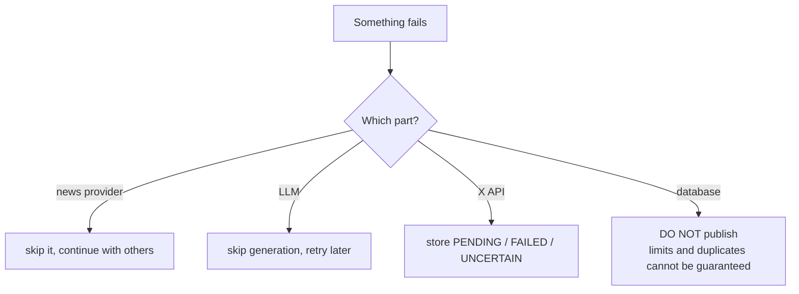

# crypto-x-agent

Autonomous crypto X account agent. **Status: Phase 1 complete (structure + database). Phase 2 (X auth + one test post) is next and stops for your confirmation.**

## Quick start

```bash
cp .env.example .env        # fill DATABASE_URL (+ X_ACCOUNT_HANDLE, ACCOUNT_TIMEZONE)
npm install
npm run migrate             # applies sql/*.sql, safe to re-run
npm start                   # validates config, checks DB, prints safety state
npm run test:limits         # proves the daily limits against a real throwaway Postgres
```

`npm run test:limits` needs a non-root user (Postgres refuses to run as root).

Safe defaults: `DRY_RUN=true`, `AUTONOMOUS_MODE=false`, and the bot starts **PAUSED** in the database.

## Project layout

```
sql/001_init.sql            schema + limit functions + hard CHECK constraints
src/config/env.ts           zod-validated env (fails fast, never prints values)
src/config/limits.ts        HARD_LIMITS (6 / 10 / 16): mirror of the DB constraints
src/db/client.ts            pg pool, query(), withTransaction(), dbHealthy()
src/db/migrate.ts           ordered, transactional, idempotent migration runner
src/db/accounts.ts          ensureAccount()
src/lib/logger.ts           JSON logger with secret redaction
src/services/events.ts      logEvent(): explainable decisions -> bot_events
src/services/rateLimit.ts   reservePublishSlot / release / peek / recordUsage / budget
scripts/test-limits.ts      27 checks against a real Postgres
```

## Architecture (target, all phases)



## The daily-limit gate (what Phase 1 guarantees)



Three independent layers enforce the limits:

1. `reserve_publish_slot()`: atomic conditional UPDATE (normal path).
2. `CHECK` constraints on `daily_usage` (6 / 10 / 16): reject even raw SQL that exceeds them.
3. `slot_limit()` clamps settings to the hard caps, so the dashboard can lower limits but never raise them.

The day boundary is computed in `ACCOUNT_TIMEZONE`.

## Other DB-level protections

| Rule | Mechanism |
|---|---|
| Max 1 unsolicited reply per conversation | partial unique index `replies_one_unsolicited_per_conversation` |
| Same text never live twice | partial unique index `posts_no_exact_dupe` on `(account_id, content_hash)` |
| No duplicate publish on retry | `idempotency_key` unique on posts and replies |
| Bot starts paused | `settings.bot_status = 'PAUSED'` seeded; reserve refuses unless `RUNNING` |

## Data model



## Failure behavior



## Notes and decisions to confirm

- Post/reply length is capped at **280** chars in the schema. If the account has longer-post access, relax the `char_length` checks.
- `DATABASE_SSL=true` uses `rejectUnauthorized: false` (common for Supabase poolers). Tighten with the provider CA if you prefer.
- OAuth 2.0 refresh tokens on X may rotate on each refresh, so Phase 2 will store tokens in the database instead of `.env`. This will be verified against the current X docs before it is built.

## Roadmap

| Phase | Scope | State |
|---|---|---|
| 1 | Structure + database | done |
| 2 | X auth + ONE manual test post | next, then STOP for your confirmation |
| 3-10 | LLM, news, post engine, conversations, reply engine, replies, dashboard, hardening | not started |
